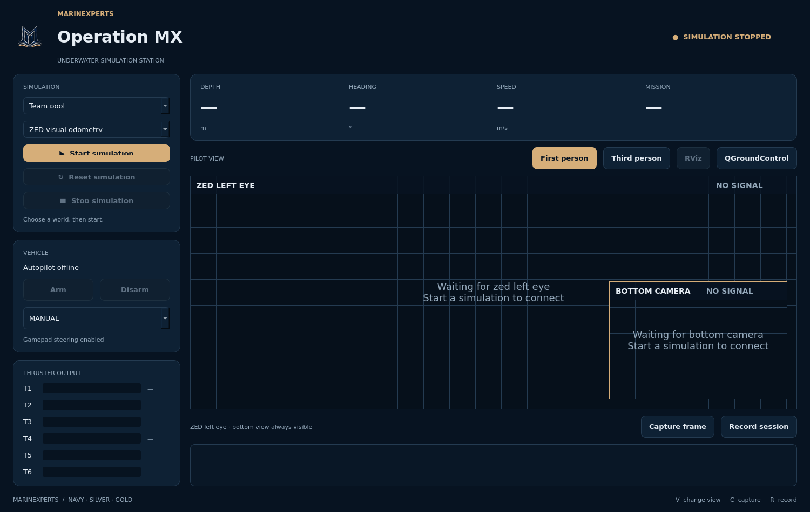
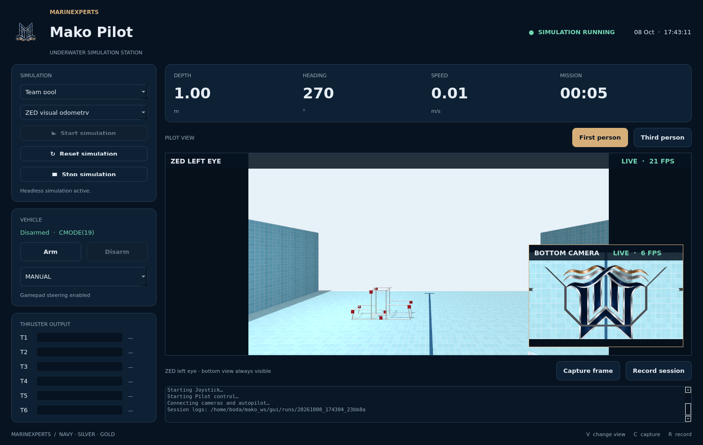
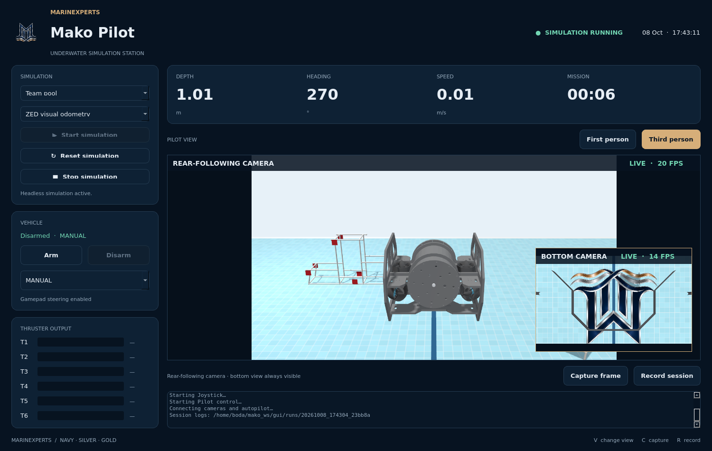
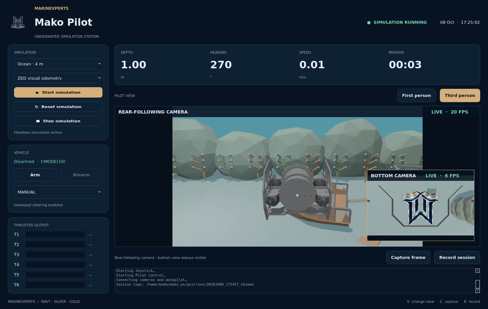

# MarineXperts — Operation MX & Software2026

Operation MX is the MarineXperts desktop pilot station for the Mako underwater ROV. It starts ArduSub SITL, MAVROS, Gazebo, the gamepad driver and the RealJoy controller from one window. It displays camera feeds and telemetry, supports first/third-person views, and provides frame capture and desktop recording.



*Current Operation MX interface, captured with the simulation stopped. The RViz and QGroundControl buttons sit above the camera view.*

## Repository layout and branches

Branch names are case-sensitive:

- **`Boda` (this branch):** `Software2026/`, the ROS 2 `real_joy` package, Operation MX and experimental camera scripts.
- **`boda`:** the companion `robot_description` simulation workspace, Mako model, pool/ocean worlds, `commands.txt`, Docker tooling and simulation checks.

Operation MX needs **both workspaces** for its managed simulation. The Docker image on `boda` runs the simulator; its current Dockerfile does not install this branch's Operation MX/RealJoy package. The instructions below install the desktop stack natively.

```text
Software2026/
├── run_mako_gui.sh          # Launcher for the original /home/boda installation
├── OperationMX.desktop     # Desktop entry with original machine paths
├── JOYSTICK.md             # Detailed controller tuning and tests
├── MAKO_PILOT.md            # Earlier app notes (Mako Pilot was the old name)
└── src/real_joy/
    ├── launch/real_joy.launch.py
    ├── src/joystick.cpp     # RealJoy MAVROS controller
    ├── src/rov_gui_gst.py   # Operation MX entry point
    ├── src/mako_station/    # UI, ROS worker and simulation process manager
    ├── src/*.py            # Camera, calibration and legacy experiments
    └── test/check_joystick.py
```

## 1. Prerequisites

Use **Ubuntu 22.04, ROS 2 Humble and Gazebo Harmonic** for this project's native desktop setup. A graphical Linux session and a working GPU/rendering driver are needed for camera rendering. A USB gamepad is needed for manual piloting; the app can start without one. Screen recording uses **ffmpeg and an X11 display**. Allow space for two ROS workspaces and ArduPilot source/builds; 16 GB RAM is a useful target for simulation and compilation.

| Component | Purpose |
| --- | --- |
| ROS 2 Humble + colcon | Build and run the ROS packages |
| Gazebo Harmonic + Humble Harmonic bridge | Physics, simulated cameras and ROS image topics |
| ArduPilot ArduSub SITL + Gazebo plugin | Simulated autopilot and Gazebo connection |
| MAVROS + GeographicLib EGM96 dataset | ROS/MAVLink connection and navigation conversions |
| PyQt5, NumPy, psutil | Desktop UI and runtime support |
| ROS joy + USB gamepad | Pilot input |
| RTAB-Map odometry | ZED visual odometry option |
| RViz / QGroundControl | Optional inspection and ground station tools |

### Install ROS and desktop dependencies

First configure the ROS apt repository using the [official Humble Ubuntu installation guide](https://docs.ros.org/en/humble/Installation/Ubuntu-Install-Debs.html), including its locale and repository steps. Then install:

```bash
sudo apt-get update
sudo apt-get install -y ros-humble-desktop ros-dev-tools \
  git build-essential cmake pkg-config curl gnupg \
  python3-colcon-common-extensions python3-rosdep python3-pip python3-dev \
  python3-pyqt5 python3-gi python3-numpy python3-psutil python3-yaml \
  ros-humble-mavros ros-humble-mavros-extras ros-humble-joy \
  ros-humble-rmw-fastrtps-cpp ros-humble-xacro \
  ros-humble-robot-state-publisher ros-humble-joint-state-publisher-gui \
  ros-humble-rtabmap-odom ros-humble-ament-cmake-pytest \
  ffmpeg geographiclib-tools
source /opt/ros/humble/setup.bash
```

### Install Gazebo Harmonic and its ROS bridge

Follow the [official Harmonic Ubuntu repository setup](https://gazebosim.org/docs/harmonic/install_ubuntu/), then:

```bash
sudo apt-get update
sudo apt-get install -y gz-harmonic libgz-sim8-dev \
  ros-humble-ros-gzharmonic rapidjson-dev libopencv-dev \
  libgstreamer1.0-dev libgstreamer-plugins-base1.0-dev
export GZ_VERSION=harmonic
```

Use `ros-humble-ros-gzharmonic` for this project. Humble's usual `ros-humble-ros-gz` packages target Fortress and conflict with the Harmonic bridge; see [Gazebo's Humble/Harmonic instructions](https://gazebosim.org/docs/harmonic/ros_installation/#gazebo-harmonic-with-ros-2-humble). The Gazebo 11 directions in the old `ReadMe.txt` describe an earlier stack.

## 2. Clone both branches

Choose unused directories; do not clone over an existing workspace.

```bash
export MX_REPO=https://github.com/adhamsherif67A/adhamsherif67A-MarineXperts-Season-2027.git
git clone --branch Boda --single-branch "$MX_REPO" "$HOME/MarineXperts-Boda"
git clone --branch boda --single-branch "$MX_REPO" "$HOME/mako_ws"

export MAKO_WORKSPACE="$HOME/mako_ws"
export MAKO_SOFTWARE_WORKSPACE="$HOME/MarineXperts-Boda/Software2026"
export MAKO_ARDUPILOT="$HOME/ardupilot"
export MAKO_ARDUPILOT_GAZEBO="$HOME/ardupilot/ardupilot_gazebo"
```

Keep these four exports available in every shell used to build/run the app. The `MAKO_*` overrides let you choose other directories. The original `run_mako_gui.sh` and desktop entry contain `/home/boda/...` paths; use the portable launch commands below on a different computer.

## 3. Build ArduSub and the Gazebo plugin

The revisions below match the companion `boda` Dockerfile. For background, see the [ArduPilot Linux setup guide](https://ardupilot.org/dev/docs/building-setup-linux.html) and [ArduPilot Gazebo plugin build instructions](https://github.com/ArduPilot/ardupilot_gazebo).

```bash
git clone https://github.com/ArduPilot/ardupilot.git "$MAKO_ARDUPILOT"
cd "$MAKO_ARDUPILOT"
git checkout 375cef5813bbd4ea99a67d9f046833e1c492f439
git submodule update --init --recursive
Tools/environment_install/install-prereqs-ubuntu.sh -y
. "$HOME/.profile"
./waf configure --board sitl
./waf sub -j2

# Install MAVProxy support into the same system Python used by sim_vehicle.
python3 -m pip install --user MAVProxy==1.8.74 pymavlink==2.4.49 \
  dronecan==1.0.27 geocoder==1.38.1
export PATH="$HOME/.local/bin:$MAKO_ARDUPILOT/Tools/autotest:$PATH"

git clone https://github.com/ArduPilot/ardupilot_gazebo.git "$MAKO_ARDUPILOT_GAZEBO"
cd "$MAKO_ARDUPILOT_GAZEBO"
git checkout 082a0fe231f6e63bc8d1598f1cba461d9e2ea7f5
export GZ_VERSION=harmonic
cmake -S . -B build -DCMAKE_BUILD_TYPE=Release
cmake --build build --parallel 2
export GZ_SIM_SYSTEM_PLUGIN_PATH="$MAKO_ARDUPILOT_GAZEBO/build:${GZ_SIM_SYSTEM_PLUGIN_PATH:-}"
```

The resulting plugin must be `build/libArduPilotPlugin.so` for Harmonic. The application also adds the configured plugin build directory to Gazebo's launch environment.

## 4. Build fresh ROS workspaces

The uploaded `build/`, `install/` and `log/` files are snapshots from the original machine. Build into new directories so local CMake caches and symlinks are regenerated. The examples preserve the original **install directory in each newly cloned checkout** as `install-uploaded`, then link `install` to the fresh build.

```bash
source /opt/ros/humble/setup.bash
export GZ_VERSION=harmonic
# Run this once only if rosdep has not already been initialized:
sudo rosdep init
rosdep update

# Install the MAVROS geoid dataset using the companion repository helper.
sudo bash "$MAKO_WORKSPACE/install_geographiclib_datasets.sh"

# real_joy dependencies; Harmonic dependencies above are installed explicitly.
rosdep install --from-paths "$MAKO_SOFTWARE_WORKSPACE/src" --ignore-src -r -y

cd "$MAKO_WORKSPACE"
colcon --log-base log-local build --base-paths src/robot_description \
  --build-base build-local --install-base install-local --symlink-install \
  --cmake-args -DCMAKE_BUILD_TYPE=Release -DBUILD_TESTING=OFF
mv -- "$MAKO_WORKSPACE/install" "$MAKO_WORKSPACE/install-uploaded"
ln -s install-local "$MAKO_WORKSPACE/install"
source "$MAKO_WORKSPACE/install/setup.bash"

cd "$MAKO_SOFTWARE_WORKSPACE"
colcon --log-base log-local build --base-paths src/real_joy \
  --build-base build-local --install-base install-local --symlink-install \
  --cmake-args -DCMAKE_BUILD_TYPE=Release
mv -- "$MAKO_SOFTWARE_WORKSPACE/install" "$MAKO_SOFTWARE_WORKSPACE/install-uploaded"
ln -s install-local "$MAKO_SOFTWARE_WORKSPACE/install"
source "$MAKO_SOFTWARE_WORKSPACE/install/local_setup.bash"
```

If using existing workspaces, preserve their install directories before adapting these steps. Skip `sudo rosdep init` when it reports that rosdep is already initialized.

Check the environment before launch:

```bash
ros2 pkg prefix robot_description
ros2 pkg prefix real_joy
ros2 pkg prefix mavros
ros2 pkg prefix ros_gz_bridge
ros2 pkg prefix rtabmap_odom
gz sim --versions
python3 -c 'import PyQt5, rclpy, numpy, psutil'
test -f "$MAKO_ARDUPILOT/build/sitl/bin/ardusub"
test -f "$MAKO_ARDUPILOT_GAZEBO/build/libArduPilotPlugin.so"
```

## 5. Start Operation MX

In a graphical terminal, restore the four `MAKO_*` exports from step 2 and run:

```bash
source /opt/ros/humble/setup.bash
source "$MAKO_WORKSPACE/install/setup.bash"
source "$MAKO_SOFTWARE_WORKSPACE/install/local_setup.bash"
export RMW_IMPLEMENTATION=rmw_fastrtps_cpp
export MAKO_SIM_ROS_DOMAIN_ID=42
ros2 launch real_joy real_joy.launch.py
```

Equivalent direct entry point:

```bash
python3 "$MAKO_SOFTWARE_WORKSPACE/src/real_joy/src/rov_gui_gst.py"
```

On the original `/home/boda` installation, `bash /home/boda/Software2026/run_mako_gui.sh` also works. A desktop shortcut can use the same sourced environment and exports in a launcher script; update `Exec`, `Path` and `Icon` in `Software2026/OperationMX.desktop` to your paths before installing it.

## 6. Pilot workflow, with screenshots

1. Connect the gamepad. Choose **Team pool** or **Ocean · 4 m**.
2. Select **ZED visual odometry** for camera-based navigation, or **Ground-truth pose** for deterministic simulation pose. Visual odometry requires RTAB-Map and can degrade on low-texture views.
3. Click **Start simulation**. The app starts five managed jobs: SITL, MAVROS, Gazebo, joystick and pilot control. Wait for live camera frames and a connected vehicle state.
4. Choose **MANUAL**, **STABILIZE** or **ALT_HOLD**, then click **Arm**. Read the vehicle status and log to confirm accepted mode/arming changes. Arming is disabled until the managed session and MAVROS connection are ready.
5. Pilot with the gamepad. Monitor depth (m), heading (degrees), speed (m/s), mission time and six motor PWM indicators. Switch **First person** / **Third person** as needed; the bottom camera stays in the inset.
6. Click **Disarm** when finished. **Stop simulation** stops the app's owned jobs. **Reset simulation** stops them and starts a fresh session; select a new world while stopped. Closing the app also cleans up its session.

### First person — navigating the pool



The main feed is the ZED left eye; the inset shows the downward camera. Use this view to approach course targets and observe the vehicle's forward path.

### Third person — seeing vehicle orientation



The rear-following camera moves and rotates with the ROV. It helps show vehicle orientation and clearance while maneuvering around obstacles.

### Ocean — alternate training environment



The ocean course contains seabed terrain and underwater scenery. Choose the world before starting a new session.

*The three running-session screenshots above are real captures from the earlier Mako Pilot build. Operation MX is its current name; the current interface at the top adds RViz and QGroundControl buttons. These pictures illustrate camera views, not a newly executed simulation test.*

### Tools, capture and recordings

| Control | Use |
| --- | --- |
| **RViz** | Opens the installed `model_tf.rviz` viewer in the simulation ROS domain with simulation time. Enabled while the simulation runs. |
| **QGroundControl** | Opens an installed executable/AppImage. If absent, choose it in the file picker; the path is remembered. `MAKO_QGROUNDCONTROL=/absolute/path/to/AppImage` also works. |
| **Capture frame** / **C** | Saves the current live pilot camera frame as PNG under `$MAKO_WORKSPACE/gui/runs/captures/`. |
| **Record session** / **R** | Records the desktop through ffmpeg/X11, rather than only the camera stream. Click again to stop. Files are under `gui/runs/recordings/`. |
| **V** | Cycles the main camera view. |
| Log panel | Shows startup, connection and service errors; per-process logs are in timestamped `gui/runs/` directories. |

To install QGroundControl, follow its [official download/install instructions](https://docs.qgroundcontrol.com/master/en/qgc-user-guide/getting_started/download_and_install.html). Install the Linux prerequisites listed there, download the AppImage, make it executable with `chmod +x /path/to/QGroundControl.AppImage`, then select it in Operation MX. It is optional for the app's own piloting controls.

### Gamepad defaults and tuning

Mappings come from `joystick.cpp`; verify indices for your controller with `ros2 topic echo /joy` in ROS domain 42.

| Input | Default index | Function |
| --- | --- | --- |
| Axis | 1 | Forward/backward (inverted) |
| Axis | 0 | Lateral movement |
| Axis | 3 | Vertical movement |
| Axes | 4 and 5 | Yaw inputs (inverted) |
| Button | 6 | Arm/disarm toggle; controller confirms MANUAL before arming |
| Button | 3 | ALT_HOLD mode toggle |
| Button | 0 | Depth reference zero |

The controller sends neutral commands on stale gamepad/autopilot data. The default joystick timeout is 0.5 s. Change sensitivity/dead zones while running:

```bash
export ROS_DOMAIN_ID=42
ros2 param set /realjoy_node sensitivity_forward 0.65
ros2 param set /realjoy_node expo_forward 0.4
ros2 param set /realjoy_node smoothing_tau 0.08
```

Live parameter changes last until the node restarts. See [JOYSTICK.md](Software2026/JOYSTICK.md) for ranges and validation behavior.

## 7. Scripts and how to run them

For ROS scripts, source the three setup files from step 5 first. Simulation inspection uses `export ROS_DOMAIN_ID=42`; hardware sessions must use the domain and MAVROS connection configured for the real vehicle.

| File (under `Software2026/` unless noted) | Purpose / command |
| --- | --- |
| `src/real_joy/src/rov_gui_gst.py` | Current Operation MX entry point: `ros2 run real_joy rov_gui_gst.py`. |
| `src/real_joy/src/mako_station/app.py` | Qt interface, controls, capture/recording and external tools; launched by the entry point. |
| `src/real_joy/src/mako_station/simulation.py` | Sources workspaces, reads companion `commands.txt`, manages the five child process groups and reset/stop. Internal module. |
| `src/real_joy/src/mako_station/ros_worker.py` | ROS telemetry/images and MAVROS service requests. Internal module. |
| `src/real_joy/src/joystick.cpp` | Compiled gamepad controller: `ros2 run real_joy realjoy_node`. The app starts it automatically. |
| `src/real_joy/launch/real_joy.launch.py` | Default app launch; `hardware:=true` starts joy, RealJoy, the ZED bridge and legacy hardware UI instead. |
| `src/real_joy/src/zed_to_mavros_pose.py` | Hardware ZED pose bridge: `ros2 run real_joy zed_to_mavros_pose.py`. Subscribes `/zed/zed_node/pose`; publishes MAVROS vision pose and odometry. Requires a separate ZED publisher and MAVROS. |
| `src/real_joy/src/rov_gui_gst_legacy.py` | Retained GStreamer/MAVROS hardware dashboard: `ros2 run real_joy rov_gui_gst_legacy.py`. |
| `src/real_joy/src/rov_crabs.py` | Experimental legacy dashboard with optional YOLO detection. Set `YOLO_MODEL_PATH` to your own `.pt` weights; run with `python3`. |
| `rov_gui_gst(4).py` | Older standalone GUI snapshot. Run with `python3` and quote the filename; current app is preferred. |
| `src/real_joy/src/capture.py` | Captures up to 50 left-camera frames from H.264/RTP UDP port 5000 into `images/`. Create the folder and start a compatible sender first. |
| `src/real_joy/src/calibrate.py` | Stereo checkerboard calibration using paired `images/image_left_*.png` and `image_right_*.png`; default board is 9×6 inner corners, 25 mm squares. Set the constants for your board. `capture.py` currently saves left images only; right images must be supplied separately. |
| `src/real_joy/src/depth.py` | Interactive RGB/depth measurement tool using OpenCV, camera information and message filters. Requires matching camera topics; inspect its topic constants before running. |
| `src/real_joy/src/circle.py` | Experimental circular position-setpoint publisher for MAVROS. Requires matching local pose and autopilot mode support; not part of the normal joystick workflow. |
| `src/real_joy/src/test.py` | Experimental Theora viewer for the ZED left image. Requires a Python `image_transport` implementation exposing `ImageTransport`; the apt package alone may not provide this API. |
| `test.py` | Experimental TCP image receiver on port 5001. Requires a sender using the framing protocol in the script. |
| `task_1.py` (repository root) | Small Python exercise: `python3 task_1.py`, prints `72`. |
| `src/real_joy/test/check_joystick.py` | Isolated controller integration check with synthetic joystick/state and fake MAVROS services, ROS domain 144. |

Example experimental-script commands:

```bash
sudo apt-get install -y python3-opencv python3-transforms3d \
  ros-humble-cv-bridge ros-humble-message-filters \
  python3-gst-1.0 gir1.2-gstreamer-1.0 gstreamer1.0-tools \
  gstreamer1.0-plugins-base gstreamer1.0-plugins-good \
  gstreamer1.0-plugins-bad gstreamer1.0-plugins-ugly gstreamer1.0-libav

cd "$MAKO_SOFTWARE_WORKSPACE/src/real_joy/src"
mkdir -p images
python3 capture.py                  # Requires a UDP/RTP camera sender
python3 calibrate.py                # Requires paired checkerboard images
python3 depth.py                    # Requires ROS image/camera-info publishers
```

For optional YOLO experimentation, use a venv that can see the system ROS/Qt packages:

```bash
sudo apt-get install -y python3-venv
python3 -m venv --system-site-packages "$HOME/venvs/mx-vision"
source "$HOME/venvs/mx-vision/bin/activate"
python3 -m pip install ultralytics
export YOLO_MODEL_PATH=/absolute/path/to/your/best.pt
python3 "$MAKO_SOFTWARE_WORKSPACE/src/real_joy/src/rov_crabs.py"
```

The custom crab weights are not supplied in this branch. These older tools have separate video/topic assumptions and are not automatically started by Operation MX.

### Hardware launch

```bash
ros2 launch real_joy real_joy.launch.py hardware:=true
```

This launch starts the controller, camera-pose bridge and legacy GUI, but **does not start MAVROS or the ZED wrapper**. Configure and start those separately for your flight controller/camera. A physical ZED additionally requires its supported NVIDIA driver, ZED SDK and ROS wrapper; follow [Stereolabs' ROS 2 setup](https://www.stereolabs.com/docs/ros2). Simulation uses Gazebo images and does not require a physical ZED SDK. Confirm coordinate frames, controller mapping and vehicle parameters before using experimental control scripts on hardware.

## 8. Verification and troubleshooting

Controller check after sourcing ROS and both workspaces:

```bash
python3 "$MAKO_SOFTWARE_WORKSPACE/src/real_joy/test/check_joystick.py"
```

| Symptom | Check / fix |
| --- | --- |
| Missing ROS workspace setup | Rebuild both workspaces; verify their `install/setup.bash` and `install/local_setup.bash` links and `MAKO_*` paths. |
| Missing `commands.txt`, model or worlds | `MAKO_WORKSPACE` must point to the **lowercase `boda`** checkout. |
| ArduPilot `sim_vehicle.py` not found | Check `MAKO_ARDUPILOT/Tools/autotest/sim_vehicle.py` and the SITL build. |
| Gazebo cannot load ArduPilot plugin | Verify the Harmonic plugin build and `MAKO_ARDUPILOT_GAZEBO`; inspect the Gazebo log. |
| MAVROS geoid error | Rerun the companion GeographicLib dataset installer and restart. |
| Port busy | Stop the previous manual/app simulation; the standard session uses TCP 5760 and UDP 9002, 9003, 14550 and 14551. |
| App telemetry absent in terminal | Set `ROS_DOMAIN_ID` to the app's `MAKO_SIM_ROS_DOMAIN_ID` (default 42) and use the same RMW implementation. |
| No camera / camera offline | Check Gazebo GPU/EGL support, ROS bridges and camera topics; stale streams are marked offline. |
| Visual odometry does not initialize | Check RTAB-Map package/logs; try Ground-truth pose to isolate camera odometry issues. |
| Arm disabled / movement neutral | Wait for recent MAVROS connected state; check `/joy`, mappings, controller log and rejected services. |
| Record session fails | Install ffmpeg and use an X11 session with `DISPLAY` set. |
| Legacy UDP video fails | Check sender, UDP port 5000, GStreamer plugins and OpenCV GStreamer support. |

Logs and output live under `$MAKO_WORKSPACE/gui/runs/`. Installation commands are documentation for a fresh Ubuntu host; they have not been executed as a full clean-machine installation during this README update.
