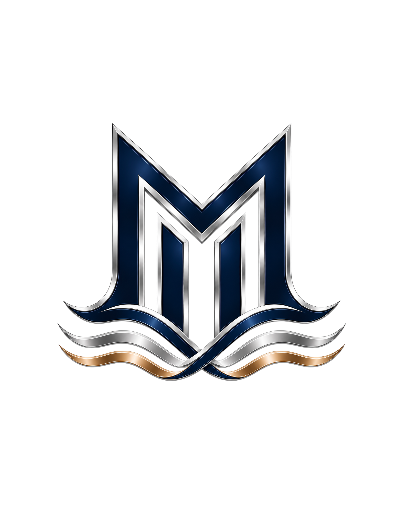

# MarineXperts — Mako ROV Simulation



ROS 2 Humble, Gazebo Harmonic and ArduSub SITL simulation for the MarineXperts Mako
ROV. Train pilots in the team pool or ocean course, inspect camera/depth data,
and develop underwater perception and visual odometry.

**Clone the `boda` branch.** Build the Docker image once, then start the complete
simulation with one command. ROS, Gazebo, ArduPilot and MAVROS run inside
the container.

## Features

### Vehicle and physics

- Six Blue Robotics T200 thrusters in the ArduSub **VECTORED** configuration.
- Black/charcoal body, colored thrusters, acrylic camera dome and landing-frame
  collision geometry for contact with the floor, walls and obstacles.
- Freshwater neutral buoyancy, aligned mass/buoyancy centers, hydrodynamic drag,
  rotational damping and gentle pool/ocean surface disturbances.
- Corrected thruster allocation and a preserved FRD IMU link for consistent
  Gazebo/ArduSub attitude feedback. STABILIZE and ALT_HOLD have live regression
  checks after yaw and vertical inputs.
- Startup motor settings are loaded **before** the first pilot command:
  `MOT_PWM_MIN=1240`, `MOT_PWM_MAX=1760`, neutral PWM **1500**.

- Gazebo reset handling restores the model and buoyancy configuration.

### Worlds

| World | Environment | Tasks and obstacles |
| --- | --- | --- |
| `pool.world` | 14 × 12 m swimming pool, 3 m deep, tiled floor/walls and one open wall | Mirrored PVC coral garden with eight red targets, colored fly transect, crabs |
| `ocean.world` | 18 × 16 m seabed, 4 m water depth, pale sand relief and reef/ship scenery | Shipwreck, broken submerged pipe and rock arch, partly buried in sand |

Both worlds contain the team logo below the ROV spawn. World assets and textures
are installed locally with the package; the courses do not require Fuel downloads.
The ROV starts near `(0, 0, -1)` in Gazebo's ENU coordinates.

### Cameras, TF and navigation

- Simulated ZED 2i left/right RGB eyes, registered depth, camera calibration topics
  and aligned point clouds, using ROS topic names familiar from the ZED wrapper.
- Pilot RGB defaults to **1280 × 720 at 30 Hz**; 60 Hz is optional. Depth and
  bottom-camera processing default to 15 Hz. Actual rates depend on GPU/load.
- Downward RGB camera inside the dome and a rear-following third-person RGB camera.
- Bounded, lazy image bridges reduce traffic when a feed is unused.
- Connected TF tree with body, thruster, sensor and optical frames; simulation
  nodes use `/clock`.
- Ground-truth odometry for deterministic testing, or ZED RGB-D visual odometry
  through RTAB-Map. Validated odometry is sent to ArduSub through MAVROS ExternalNav.
- **Visual odometry is not full SLAM.** Map building, loop closure and global
  relocalization are not enabled by this workflow.

## 1. Host requirements

Supported setup: **Linux x86-64 with Docker Engine**. Ubuntu 22.04/24.04 with
an X11 or XWayland session is the intended desktop setup. Host ROS/Gazebo/ArduPilot
installations are unnecessary. Windows/macOS Docker Desktop GUI and device
forwarding are not covered by these instructions.

Recommended resources:

- 16 GB RAM; build parallelism defaults to two jobs to limit memory use.
- At least **20 GiB free in Docker storage** for the first build; 40 GiB provides
  more room for source trees, layers and subsequent rebuilds.
- A working graphics device for smooth camera rendering. Intel/AMD `/dev/dri`
  devices are passed through by the run helper. NVIDIA requires the host driver
  and NVIDIA Container Toolkit.
- Internet access for the first image build: apt packages, Python packages,
  ArduPilot and its submodules are downloaded then.

Check Docker and Git:

```bash
docker --version
docker info
git --version
```

If Docker is missing, follow the [Docker Engine installation guide for Ubuntu](https://docs.docker.com/engine/install/ubuntu/).
For a permission error, follow Docker's [Linux post-installation instructions](https://docs.docker.com/engine/install/linux-postinstall/),
then log out and back in before continuing. Docker must be running and accessible
to your current user.

For GUI display forwarding, check `xauth` and install it only if missing:

```bash
command -v xauth >/dev/null || { sudo apt-get update && sudo apt-get install -y xauth; }
```

For NVIDIA, follow the [NVIDIA Container Toolkit installation/configuration guide](https://docs.nvidia.com/datacenter/cloud-native/container-toolkit/latest/install-guide.html).
Confirm that `nvidia-smi` works on the host. A container cannot install or replace
its host's graphics driver.

## 2. Clone the correct branch

```bash
git clone --branch boda --single-branch \
  https://github.com/adhamsherif67A/adhamsherif67A-MarineXperts-Season-2027.git \
  MarineXperts-Season-2027
cd MarineXperts-Season-2027
git branch --show-current
```

The last command must print `boda`. Authenticate with GitHub if access to the
repository is restricted.

## 3. Build the environment once

```bash
./docker/build.sh
```

The image tag is **`marinexperts/mako:boda`**. The build helper matches the
container user UID/GID to your Linux account for device and shared-memory access. The first build downloads and
compiles dependencies, so its duration depends on your network and machine.
Once successful, no additional package installation is needed inside the container.

What the Docker build prepares:

1. Ubuntu 22.04 / ROS 2 Humble base.
2. Gazebo Harmonic and the **Harmonic-compatible** Humble `ros_gz` packages.
3. MAVROS, RViz, RTAB-Map odometry and ROS build tools.
4. The GeographicLib EGM96 geoid required by MAVROS.
5. Pinned ArduPilot/ArduSub and ArduPilot Gazebo plugin source builds.
6. This repository's vehicle, worlds, custom water/reset plugin.

Installation is checked before it runs: the apt helper queries `dpkg`, the Python
helper checks pinned package versions and the dataset installer checks its geoid
file. Already installed items are skipped. Docker layers are reused on subsequent
builds. These checks concern packages **inside the image**: Docker does not reuse
or inspect unrelated ROS installations on your host.

`./docker/build.sh` also skips an already-existing image. After source changes,
explicitly rebuild it:

```bash
./docker/build.sh --rebuild
# Optional: choose source-build parallelism.
./docker/build.sh --rebuild --jobs 4
```

`BUILD_JOBS` controls both the ArduPilot/plugin builds and workspace compilation.
The Dockerfile pins upstream source revisions; apt packages/base-image updates
are not locked byte-for-byte. Avoid installing the normal Humble Fortress
`ros-humble-ros-gz` packages alongside the Harmonic bridge. See the
[Gazebo Humble/Harmonic installation guidance](https://gazebosim.org/docs/harmonic/ros_installation/).

## 4. Check the image

```bash
docker run --rm marinexperts/mako:boda doctor
```

The check verifies ROS packages, Python imports, ArduSub, the Gazebo plugin and
its linked libraries, the geoid dataset and both worlds. It should finish with
`RESULT: ready`. Missing items cause a nonzero exit; runtime does not silently
install packages.

## 5. Start the simulation

### Team pool with the Gazebo GUI

```bash
./docker/run.sh --world pool.world
```

This starts **ArduSub SITL + MAVProxy + MAVROS + Gazebo + ROS sensor/TF bridges**.
The wrapper handles display cookies, host networking/shared memory and available `/dev/dri`
devices. It does not require a broad `xhost +` grant.

### Ocean course

```bash
./docker/run.sh --world ocean.world
```

### NVIDIA GPU

```bash
./docker/run.sh --nvidia --world pool.world
```

### Headless server, with cameras still rendered

```bash
./docker/run.sh --headless --world pool.world
# Optional software rendering for a machine without an accessible graphics device.
LIBGL_ALWAYS_SOFTWARE=1 ./docker/run.sh --headless --world pool.world
```

Headless removes the Gazebo GUI; it does not disable RGB/depth sensors. Software
rendering can be much slower than a GPU.

### ZED-only visual odometry

```bash
./docker/run.sh --world pool.world --odometry-source vision
```

Use the default `ground_truth` source for repeatable physics/control debugging.
Use `vision` to test camera-based pose estimation; it does not consume Gazebo
pose as an estimator input. Textured, visible scenes and sufficient image rate
are necessary for visual tracking.

### Optional 60 Hz pilot feed

```bash
./docker/run.sh --nvidia --pilot-fps 60
```

This changes the pilot RGB rate. Depth/odometry processing remains independently
configured; setting 60 does not guarantee 60 delivered frames on every GPU.

## 6. Inspect ROS topics

Open another terminal while `mako-sim` is running. Execute commands through the
image entrypoint so ROS/workspace setup is sourced:

```bash
docker exec -it mako-sim /bin/bash /entrypoint.sh bash
```

Inside that shell:

```bash
ros2 topic list
ros2 topic echo /mavros/state --once
ros2 topic echo /mavros/rc/out --once
ros2 topic hz /zed2i/zed_node/left/image_rect_color
ros2 run robot_description check_sim_tf.py
```

Useful topics:

| Topic | Data |
| --- | --- |
| `/clock` | Gazebo simulation time |
| `/tf`, `/tf_static`, `/joint_states` | Robot and sensor transforms |
| `/odometry/gz` | Gazebo reference pose/twist |
| `/zed2i/zed_node/left/image_rect_color` | First-person RGB |
| `/zed2i/zed_node/right/image_rect_color` | Right-eye RGB |
| `/zed2i/zed_node/left/depth/image_raw` | Left registered depth |
| `/zed2i/zed_node/point_cloud/cloud_registered` | Aligned point cloud |
| `/bottom_camera/image_raw` | Downward RGB |
| `/third_person_camera/image_raw` | Rear-following RGB |
| `/zed2i/vo/odometry` | Camera-based odometry, when `vision` is enabled |
| `/mavros/state` | Connection, actual mode and arming state |
| `/mavros/manual_control/send` | Pilot movement commands |
| `/mavros/odometry/out` | Selected ExternalNav stream to ArduSub |

Camera bridges are lazy: subscribing activates the relevant feeds. Use simulated
time for your own ROS nodes and RViz. With GUI forwarding enabled, launch RViz from this shell, for
example `ros2 launch robot_description view_tf.launch.py`.

The default ROS domain is **42**. To inspect from host ROS tools, source your ROS
installation and set `ROS_DOMAIN_ID=42` and `RMW_IMPLEMENTATION=rmw_fastrtps_cpp`.
Set `ROS_DOMAIN_ID` before `docker/run.sh` to select another domain.

## 7. Stop, reset and retain logs

Press **Ctrl+C** in the launch terminal or run:

```bash
docker stop mako-sim
```

The supervisor stops its process groups; the run helper uses `--rm`, so the
container is removed after shutdown. A complete reset is stop followed by the
same `docker/run.sh` command. This restarts SITL, MAVROS and sensors.
The Gazebo reset button resets world state, but does not restart the flight
controller or every ROS process.

The supervisor prints its session log directory inside the container, under
`/home/sim/mako-runs/`. ROS/MAVProxy files are stored there; process output appears
in the Docker terminal. Before stopping, save logs to the host:

```bash
docker logs mako-sim > simulation.log 2>&1
docker cp mako-sim:/home/sim/mako-runs ./simulation-runs
```

## Troubleshooting

| Symptom | Check / action |
| --- | --- |
| Image already exists but changes are absent | Run `./docker/build.sh --rebuild`. |
| Build refuses to start / disk fills | Free Docker storage; the helper requires 20 GiB. It never prunes images automatically. |
| Docker socket permission denied | Finish Docker's post-installation setup and log in again. |
| GUI cannot open | Check `DISPLAY`, `/tmp/.X11-unix` and `xauth`; try `--headless`. |
| NVIDIA runtime error | Install/configure the host NVIDIA Container Toolkit; verify the host driver. |
| Black/slow images | Check GPU access, subscribe to the image topic, reduce rendering load or pilot rate. Software EGL is a fallback. |
| MAVROS exits immediately | Run `doctor`; confirm the EGM96 geoid exists. |
| Port is occupied | Stop another SITL/MAVROS instance. Default ports are 9002/9003, 5760 and 14550/14551. |
| MAVROS invisible from host terminal | Use the same ROS domain and middleware; avoid a second MAVROS instance. |
| Movement changes direction after startup | Rebuild the image; the complete parameter file must load before SITL starts. The container disables delayed parameter rewriting. |
| ALT_HOLD/STABILIZE spins or flips | Check the corrected URDF motor mapping, preserved IMU link and startup motor directions. |
| TF old-data warning after reset | Restart your viewer with `use_sim_time=true`; use a full session restart when estimator time/history must reset. |
| Visual odometry loses tracking | Inspect `/zed2i/vo/odom_info`, textures, depth visibility and image rate. Use ground truth to separate perception from physics problems. |

The mounted Bar30 position currently uses a Gazebo atmospheric `air_pressure`
sensor, **not a calibrated hydrostatic depth sensor**. ArduSub depth estimation
uses the selected ExternalNav source. Water motion is a lightweight disturbance
model, not a full computational fluid dynamics solver. The simulated ZED topics
are produced by Gazebo/ROS bridges; the physical ZED SDK/wrapper is not required.

## Development and checks

The container has the source and build tools. For a development shell:

```bash
docker run --rm -it marinexperts/mako:boda bash
```

Sources are under `/opt/mako_ws/src`; ArduPilot and its plugin are under
`/opt/ardupilot` and `/opt/ardupilot_gazebo`. Modify host sources and rebuild the
image to distribute changes. Source-build parallelism can be limited with
`MAKEFLAGS=-j2` and `./docker/build.sh --jobs 2`.

Useful verification commands inside the container:

```bash
python3 -m unittest discover -s /opt/mako_ws/src/robot_description/test -q
python3 /opt/mako_ws/docker/simulation.py --dry-run --headless
python3 -m unittest discover -s /opt/mako_ws/docker -p "test_*.py" -q
```

Validation status: model/frame checks and simulation setup tests have passed locally. Container scripts have syntax/command checks and a cached-image smoke test
with a read-only known-working Humble/Harmonic overlay verified connected MAVROS
and 1280×720 pilot/bottom images. This is runtime validation, not a fresh-image
build. A fresh build
of the complete replacement Dockerfile still needs validation on a machine with
sufficient Docker storage; it is not claimed as a certified clean-image build.

## Repository structure

```text
Dockerfile                         Complete simulation environment
entrypoint.sh                      Sources ROS/workspace and selects a command
docker/
  build.sh                         Build once / explicitly rebuild
  run.sh                           Display and GPU forwarding
  simulation.py                    SITL + MAVROS + Gazebo supervisor
  doctor.py                        Read-only installed-environment check
  install-apt.sh                   Install only missing apt packages
  install-python.py                Check/install pinned Python packages
commands.txt                       Base SITL and MAVROS commands
src/robot_description/
  urdf/                            ROV, thrusters, sensors and ArduPilot mapping
  worlds/                          Pool, ocean and local task assets
  config/                          Bridges, odometry and startup parameters
  launch/                          Gazebo, TF/RViz and visual odometry
  scripts/                         Cloud/pose relays and simulation diagnostics
  test/                            Frame, physics/configuration and live checks
```

Generated `build/`, `install/`, logs and machine-specific runtime files are not
needed in a clean clone. `.dockerignore` excludes them from the image context.

## Upstream projects and assets

- [ROS 2 Humble](https://docs.ros.org/en/humble/)
- [Gazebo Harmonic](https://gazebosim.org/docs/harmonic/)
- [ArduPilot / ArduSub](https://github.com/ArduPilot/ardupilot)
- [ArduPilot Gazebo plugin](https://github.com/ArduPilot/ardupilot_gazebo)
- [MAVROS](https://github.com/mavlink/mavros)
- [RTAB-Map ROS](https://github.com/introlab/rtabmap_ros)
- [Stereolabs ZED ROS 2 wrapper](https://github.com/stereolabs/zed-ros2-wrapper), for topic/frame conventions
- [BlueROV2 Gazebo model](https://github.com/clydemcqueen/bluerov2_gz), for appearance references

Upstream components retain their own licenses. Check the per-asset README files
and package metadata before redistributing meshes, textures or team artwork.
